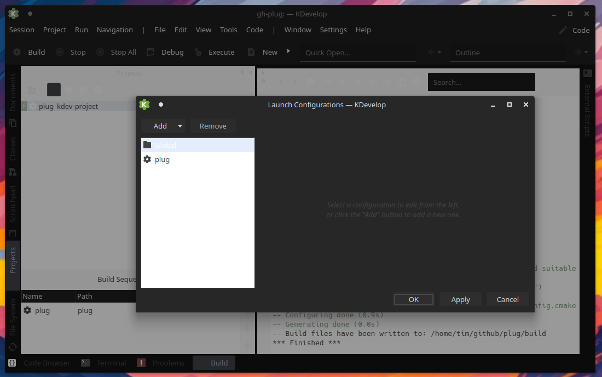

# Building/debugging with KDevelop

On machines with the KDevelop IDE is installed, that IDE can be used
to build and debug plug.

One way to get this working is to check the project out manually, then 
use the KDevelop menu option 'Project'/'Open / Import Project ...' and
navigate to the checkout directory:  

then press the 'Next' button, the next screen should look like this:

then press the 'Finish' button, a popup like this should appear:

then press 'Open Existing File', another popup like this should appear:

then press the 'OK' button, and the project should open in KDevelop 
and look something like this:

At this point, the right hand pane should show the output of a cmake 
makefile-generation operation on the project, and it should be possible to 
use the 'Build', button in the IDE.

To run the program, you need to select the 'Run' / 'Launch Configurations ...'
menu option, which brings up this dialog:

On this dialog, select the 'plug' line in the left pane, then click the 'Add'
dropdown and select 'Compiled binary' which should bring up an automatically 
populated item in the right pane looking like this:

Click the 'OK' button to save the new run configuration, and it should
be possible to run plug using the 'Execute' and 'Debug' buttons in the IDE. 

## Fetching a git sandbox using KDevelop - not recommended for now

Note that the KDevelop IDE does have the capability to open a project
directly from GitHub, using a GitHub plugin, but the authorization 
integration of this plugin (as at KDevelop version 4:23.08.5 running on 
Ubuntu 24.04 LTS), is hard to get working because it predates the enablement 
of 2FA, passcode innovations on GitHub itself.  

KDevelop can also check projects out using non-GitHub git and HTTPS URLs, but 
does not seem to be able to handle git-over-ssh URLs 
(e.g. like git@github.com:offa/plug.git) so it doesn't play well if you want 
to push your changes using SSH private key authentication.

